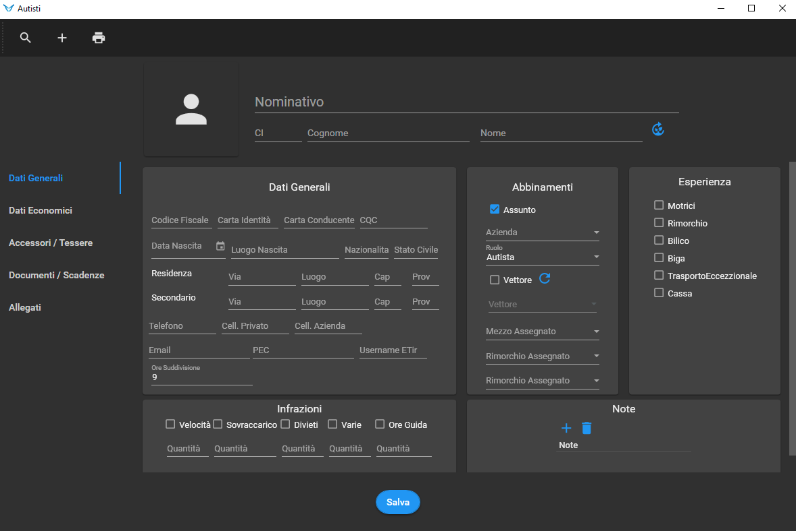

# SCOPO FORMAZIONE:

Lo scopo della formazione è istruire il cliente nell'inserimento delle varie anagrafiche all'interno del programma.

Durante la formazione si vedranno:
- Anagrafiche Azienda
- Anagrafiche Mezzi
- Anagrafiche Dipendenti
- Anagrafiche Clienti
- Anagrafiche Banche
- Anagrafiche Vettori
- Anagrafiche Fornitori

Durata media della formazione: **1h:30m**

# FORMAZIONE:

# AZIENDE:

Qui è possibile inserire i dati relativi alle aziende.      
È importante inserire **ALMENO** una Filiale ed un **Codice**.    

> Solitamente il Codice è una lettera dell'alfabeto, in caso di monoazienda in genere si utilizza A.

> L'inserimento dell'azienda è fondamentale per la Fatturazione.

# INSERIMENTO UTENTI

Premi su `Admin` in alto a destra poi NUOVO UTENTE ed inserisci i vari dati.    

> L'utente amministratore può segliere quali moduli possono vedere gli altri utenti.

# MEZZI:

La prima cosa da fare quando si inserisce un mezzo è inserire la targa.

> ATTENZIONE: una volta scelto un formato targa si consiglia di utlizzare sempre quello ad esempio se prima inserisco un mezzo targato *AB123CD* il successivo sarà *BC456DC* e NON *BC 456 DC*.
    
In descrizione di solito si mette: MARCA MODELLO.        

Quando inserisco un nuovo mezzo è importante specificare se è una `MOTRICE`(o Trattore) oppure un `RIMORCHIO`(o Semirimorchio).

> Ho la possibilità di nascondere l'anagrafica del mezzo e di escluderla dall'operatività attraverso i flag **Nascondi**, **Non in Elenco** e **Venduto**.

FLAG:
- Nascondi: In caso volessi escludere il mezzo temporaneamente dall'operatività.
- Non in Elenco: In caso volessi escludere il mezzo dall'operatività per un periodo prolungato / indefinito.
- Venduto: Per mantenere l'anagrafica a fini reportistici anche dopo aver venduto il mezzo.

### DATI GENERALI:

- **DATI ANAGRAFICI:**

Qui è molto importante inserire i `Giorni Lavorativi Mensili` al fine dell'analisi costi.
> Se al mezzo è abbinato un autista sarebbe bene che il numero delle giornate lavorative combaciasse.

Si può evitare di inserire `Km` e `Ultimo Rifornimento` in quanto verranno automaticamente popolati durante l'utilizzo del programma (rispettivamente creando nuovi viaggi ed inserendo i rifornimenti)

Il campo `CATEGORIA` può essere utile in quanto posso usarlo come filtro per i mezzi nel pianificatore.

> Le Categorie sono definite dall'utente e per popolare il menu a discesa bisogna aggiungerle nella schermata che si apre dopo aver premuto il bottoncino **Lista** a fianco della casella di testo

- **ABBINAMENTI:**

Qui posso decidere se il mezzo è `PROPRIO` oppure appartiene ad un `VETTORE`
> Nel caso in cui il mezzo appartenga ad un vettore posso inserire la targa come "TARGA - RAGIONE SOCIALE VETTORE" oppure solo "RAGIONE SOCIALE VETTORE" così da semplificare la ricerca del mezzo.

Posso abbinare un Mezzo ad un Autista e viceversa.     
Al mezzo posso anche abbinare un rimorchio.

> Nel caso di multiazienda serve compilare anche i campi `Azienda` e `Sede` per specificare a quale azienda e sede appartiene il mezzo.      

- **COLLEGAMENTI:**

> Serve solo in alcuni casi (App ETir/Satellitare)

- **SPECIFICHE TECNICHE:**

Sono dati situazionali che posso aggiungere per completismo.

> Alcuni di questi però sono utili ad esempio l'ingombro del mezzo serve nel calcolo delle mappe mentre il numero assi serve per il calcolo dei pedaggi.

### ACCESSORI / DOTAZIONI:

- **DOTAZIONI E SICUREZZA:**

Qui si inseriscono tutti quei dispositivi che voglio assegnare al mezzo con le loro eventuali date di scadenza (*esempio: estintore, cinghie, trnspallet*).        
Questa sezione serve per riepilogare tutto ciò di cui dispone il mezzo.         
- Aggiungi dispositivo e premi su salva -> mostra Avviso di scadenza che apre foglio scadenze

- **GESTIONE TESSERE:**     

Questo modulo serve per gestire le tessere legate ai mezzi ad esempio: *tessere rifornimento, DKV, telepass...*        
> Posso dare una data di scadenza delle tessere che può essere scadenza effettiva oppure 
una scadenza decisa da me perché per esempio voglio spostare la tessera in un'altro mezzo.

## SPESE / SCADENZE:

### SPESE:      

IMPORTANTE per l'analisi dei costi.

Qui si inseriscono tutte le spese fisse del mezzo.             
*Il programma per l'analisi costi prende le spese fisse da QUI*.         
Posso inserire le spese con Importo in € e Suddivisione temporale.        
Per le scadenze a km serve cliccare sul camioncino perché il programma calcola in automatico quanto la spesa incide per ogni km.
Fai vedere abbina spese a più mezzi.           

Le spese come gomme o freni sono previsionali quindi si basano sui dati passati.

### SCADENZE:

Le spese di solito comportano delle scadenze.       

> Se sto inserendo una scadenza non posso salvare l'anagrafica se prima non la salvo o annullo.      

Qui posso creare delle scadenze a Km o a Data.        
- Spiega quadratino a destra di GG da ripetere (Data di Scadenza, Data di Esecuzione)        
> Finchè non chiudi le scadenze te le mostra ogni giorno.
- Mostra scadenziario con filtro, tutte, chiusura scadenze e stampa scadenze con tasto dx
Mostra pulsanti Da Eseguire, Eseguite, Tutte.

Fai esempi:

 
- BOLLO: è una scadenza a data:       
    Posso metterci dei `giorni di preavviso` e così facendo quando la scadenza entrerà in preavviso la vedrò in scadenziario.              
    Posso scegliere se generare una scadenza successiva dopo tot. giorni.

- Tagliando: è una scadenza kilometrica quindi il preavviso sarà in km.
> Se si collega il mezzo ad un ente satellitare come COMPASS si aggiorneranno i km in tempo reale.

Si possono abbinare le scadenze inserite anche ad altri mezzi (previa inserimento anagrafiche).            

Le scadenze si possono chiudere dalle anagrafiche, ma conviene usare lo scadenziario.

## EVENTI:

Si approfondirà più avanti con i Pianificatori.

## ALLEGATI:

Qui posso aggiungere eventuali allegati che voglio abbinare al mio mezzo.
> *Esempio: file di testo, file pdf, documenti,immagini*

# DIPENDENTI:

# CLIENTI:

# BANCHE:

# VETTORI:

# FORNITORI:

# STRUTTURA MODULO:

Per vedere la guida approfondita dei moduli clicca [QUI](https://github.com/Fucio992/GuidaTir/tree/master/TIR%20ELITE/moduli/anagrafiche).

# COLLEGAMENTI:

## LISTINI:

# IMPOSTAZIONI:

NOTE SU ANAGRAFICHE R: (FORMAZIONE DA RIPORTARE SU GITHUB)

InRiepilogo (su spese scadenze mezzo) serve per definire quali spese finiranno in riepilogo e quali no.
Serve per l'analisi costi

INFRAZIONI MODULO AUTISTA:
Posso specificare gli accordi presi con l'autista:
per esempio: gli pago fino a 5 eccessi di velocità e finop ad un totale di 1550€

ANAGRAFICA CLIENTI:
Agenzia mi fa comodo per segnare Agenzie di viaggi che non hanno mezzi propri ma affidano tutto ai vettori.

AVVISO IN CONFERMA
è utile per esempio se hanno diversi uffici.
Amministrazione mette avviso "cliente bloccato perché non paga" così poi l'operativo si comporta di conseguenza

Divisione Cliente mi crea le sedi (di fatturazione)

# ANARAFICHE AUTISTI

Sono diversi dai Dipendenti perchè l'autista è Parte integrante dei viaggi mentre il dipendente NO.

## FILTRI:

### **FLAG:**

- ATTIVI: Filtra le anagrafiche che sono disponibili / operative ed esclude quelle che hanno il flag su nascondi o gli autisti licenziati.
- INTERNI: Filtro che esclude gli autisti con flag su esterno.
- NASCONDI: da flaggare per nascondere l'anagrafica Autista.
- ESTERNO: Per flaggarlo bisogna creare un Vettore ed in Dati Aggiuntivi (di anagrafica Vettori) si deve aggiungere l'autista.

Anche qui ci sono le stampe ed i documenti.
> In documenti posso inserire per esempio le patenti in modo da averle sempre pronte in caso di evenienza.

## VISUALIZZAZIONE:

Come per i Mezzi il codice è progressivo e non si può cambiare.        
Se c'è una nomenclatura interna all'azienda posso inserire il C.I. (Codice Interno)      

Le anagrafiche si inseriscono nel formato "Cognome Nome" così da agevolare la creazione di report con gli autisti in ordine alfabetico.

## DATI GENERALI:

Qui ci sono molti campi ma sono autoesplicativi.       
Anche in anagrafica autisti (come per i mezzi) posso assegnare un mezzo ad un autista a patto che sia stata precedentemente inserita l'anagrafica del mezzo.          
Qui si può indicare anche l'esperienza dell'autista.       

### **Condizioni Contrattuali:**

Mi permettono di tenere uno storico degli autisti all'interno dell'azienda.       
Per vedere lo storico basta cliccare il pulsante "+".            

ASSUNTO: se è flaggato significa l’autista è in forza e lavora, in alternativa l'anagrafica rimane ma l'autista NON risulta attivo.           
Se l'autista dovesse andare via un periodo per poi tornare per riassumerlo mi basta flaggare assunto e cambiare la data di assunzione.          

NON posso usare Le patenti come filtro al di fuori della ricerca anagrafiche.

> Se l'autista ha il flag su `MECCANICO` posso richiamarlo anche nella scheda `FOGLIO OFFICINA` in caso l'azienda avesse un'officina.

### **GESTIONE TESSERE** 

Qui possono essere inserite tessere come DKV, Cartissima Q8.       
Posso mettere le scadenze effettive oppure se volessi spostare la carta in un'altro mezzo dopo una specifica data potrei inserire quella data lì.       

**PER INSERIRE UNA CARTA:**        

Premi `Nuovo` e Popola campi.       
Nella griglia sotto puoi vedere le varie tessere inserite.
- Se premi su `Avviso` puoi aggiungere la scadenza nello scadenziario.

## DATI ECONOMICI:

Qui posso inserire le spese fisse del mio autista, il modulo è composto di 4 sezioni.         

### Compensi / Trasferte:

In questa sezione posso definire i dati inerenti al pagamento del mio autista quindi `Paga Base`, `Contributi` e `Giorni Lavorativi` ma posso 
aggiungere anche eventuali Supplementi.         

> In paga base si consiglia di inserire la media fatta sull'aspettativa di costo annuale dell'autista perché GIORNI LAVORATIVI è un parametro standardizzato e potrebbe quindi discostarsi dalla realtà.           

In caso il cliente volesse inserire gli stipendi mese per mese mostra l'icona `€` ed attiva funzione che prende lo stipendio aggiornato per l'analisi costi.

Per i supplementi ho a disposizione fino a 10 etichette personalizzabili che mi appariranno poi in fase di creazione viaggi dove potrò eventualmente aggiungerli per calcolare i costi dell'autista.

### Dati per Bonifico:

Qui devo inserire i dati per il pagamento dell'autista.        
Se premo su quadratino di popolamento apro anagrafica Banche.        
> In anagrafiche banche posso scorporare l'IBAN.         

### Infrazioni:

Qui posso inserire le multe che ha preso l'autista (Qtà = Quantità ed Imp = Importo).             
> Serve a fini statistici.         

### Note:

Qui posso inserire delle note interne per il mio autista.               

## DATI AGGIUNTIVI:

In dati aggiuntivi posso inserire eventuali documenti oppure dati situazionali 
di altra natura.

## DOTAZIONI / SICUREZZA:

Come per Mezzi anche qui posso inserire tutte le varie dotazioni che voglio affidare ad uno specifico autista.
> Posso abbinare un set di dotazioni a più autisti premendo sul guanto.

La stampa delle dotazioni NON è attivata di default quindi in caso devo passarla io.           

## SCADENZE:

Come per Mezzi ma senza scadenze a KM.

## SPESE:

In questo modulo è possibile inserire le spese una tantum per gli autisti come per esempio il 
passaggio in un mercato oppure eventualmente un pranzo o una cena pagato a nome dell'azienda.         

## CORSI:

Qui puoi visualizzare i corsi assegnati ad uno specifico Autista ed inserirne di nuovi.       
*ATTENZIONE: Se inserisco un corso nuovo NON si abbina in automatico all'autista ma devo abbinarlo io*      
Posso abbinare lo stesso corso a più autisti.        

## MULTE:

Come per mezzi.

# ANARAFICHE CLIENTI, VETTORI, FORNITORI:        

Sono molto simili fra loro, cambia solo qualche campo.     
Il codice è Progressivo come in mezzi ed autisti ma è in comune fra `Clienti`, `Vettori`, `Fornitori`.        

> IMPORTAZIONE CLIENTI: di solito la facciamo se e solo se l'azienda ha più di 50 clienti.

# CLIENTI:

## BARRA FILTRI:

- AGENDA: permette di inserire scadenze (in scadenziario) per Clienti, Vettori, Fornitori o Generali.
- Duplica è utile nel caso in cui il mio cliente fosse anche un fornitore o vettore.       

## VISUALIZZAZIONE:

Qui è Importante Inserire la RAGIONE SOCIALE.          
> in caso il cliente utilizzi Open Manager va inserito il codice Contabile.

## **ANAGRAFICA:**     

> Codice Contabile serve in caso si utilizzi un programma di contabilità come ad *esempio: Open Manager*.

> Il flag Bloccato mi nasconde il cliente in caso di Filtro `Attivi` ma POSSO comunque selezionarlo in fase di creazione conferme anche se mi apparirà un pop up con scritto "Cliente Bloccato".         

### **CAMPI IMPORTANTI:**
- Ragione Sociale
- Indirizzo di FATTURAZIONE (Inserisci Sede Legale)
- SDI o PEC X FE (in caso ci fossero clienti esteri su SDI vanno segnate 7 X)
- p.IVA (se < 11 cifre devi mettere degli 0 davanti fino ad arrivare alle 11)
- Codice Fiscale

> In titolo si inserisce: *egregio, illustre...*             

> Se il cap è minore di 5 cifre devi inserire degli zeri davanti fino a raggiungere le 5 cifre.
> *esempio: 321 NON va bene quindi devo scrivere 00321*.

> In caso il cliente fosse un ente pubblico oppure un azienda partecipata va flaggato `SPLIT PAYMENT` e lo SDI sarà di 6 lettere.

> In fase di inserimento di altre sedi specifica che gli indirizzi devono essere indirizzi di fatturazione dove posso spedire le fatture.

### **MODALITÀ DI PAGAMENTO:**        
 
Qui si inseriscono le varie modalità di pagamento per quello specifico cliente.                    
I Codici Scadenza sono Personalizzabili.        
*esempio: Bonifico 60 gg -> BB60*.        
> IMPORTANTE: Se il cliente usa OPEN MANAGER i codici scadenza `DEVONO` essere di 3 caratteri.                

> IMPORTANTE: NON possono esserci 2 metodi di pagamento con lo stesso `CODICE SCADENZA` o la stessa `DESCRIZIONE` altrimenti genera un errore.

In `NUMERO GIORNI PER IL CALCOLO` si possono scindere i pagamenti in più scadenze.         
*esempio:*                
-  *In caso di Bonifico 30/60 scrivo 30_30_30*
-  *In caso di Bonifico 30/90 scrivo 30_60*
-  *In caso di Bonifico 30/60/90 scrivo 30_30_30*

>  In quest'ultimo caso i pagamenti saranno cos' ripartiti:
>  - pagamento 1 dopo 30 gg
>  - pagamento 2 dopo altri 30 gg
>  - pagamento 3 dopo altri 30 gg

Inserire il Tipo Effetto.       
-  Mostra Flag "DATA FATTURA" e "FINE MESE".

> Giorni mese successivo serve se ho per esempio Bonifici a 30+10gg.

**IMPORTANTE**: Inserire I Codici per Fattura Elettronica.              
> Se sono sbagliati mi esce XML sbagliato.        

### **ALIQUOTE IVA / NATURA IVA:**            
Qui puoi selezionare le varie Aliquote con relative Esenzioni.             

**IMPORTANTE:** Inserire Codici per Fattura Eletrtonica.               
> Se sono sbagliati mi esce XML sbagliato.                 

### **BANCHE PER STAMPA FATTURA:**

Qui posso aggiungere le banche attraverso il quadratino di popolamento.        
- Clicca su quadratino per aggiungere una banca.

Se clicchi sul Bottone con le 3 linee scorpora l'IBAN.
>  In caso di pagamenti tramite bonifico devo inserire la mia banca mentre nel caso di pagamenti con RiBA devo inserire 
la banca del cliente, in ogni caso qui inserisco la banca che deve uscire nella fattura.

>  Il Flag su Propria mi permette di filtrare solo le banche proprie.

Posso inserire più sedi di Fatturazione ed eventuamente selezionare una sede Standard 
ma è importante che siano sedi a cui effettivamente io poi vado ad inviare fatture.            

> Da conferme si può selezionare la sede a cui fatturare.

## **SPESE / SCADENZE / NOTE:**     

### **SPESE FATTURA:**

 -  Mostra Lettera d'Intento e Gestione Plafond.         
 -  Mostra Aggiunte e fai esempio Bollo Virtuale.

> Se sforo il Plafond il programma mi avvisa.

Di norma le 3 righe si usano così:       
1) Bollo Virtuale.     
2) Riga descrittiva che appare in causale XML.     
3) Riga Jolly.

### **SPOSTAMENTO SCADENZE:**  

-  Fai esempio: se Azienda chiude ad Agosto sposto le scadenze a Settembre.

### **NOTE:**                 
 
- NOTE CLIENTE: Note eventuali da visualizzare solo in questa sezione.
- NOTE AVVISO: Note da visualizzare in punti predefiniti del programma.
                     
## **DATI AGGIUNTIVI:**     

 Dati molto situazionali.

# VETTORI:

Come Clienti ma in `DATI AGGIUNTIVI` è importante segnare i dati relativi al `DURC` in quanto SENZA il Vettore NON è in regola.          

# FORNITORI:

## **ANAGRAFICA:**  

Come Clienti ma con meno campi.        
È IMPORTANTE segnare la `categoria` in modo da poter richiamare i fornitori in altre parti del programma.

> In fornitori NON ho la possibilità di inserire le sedi perché NON fatturo al Fornitore ma è lui che fattura a me.
