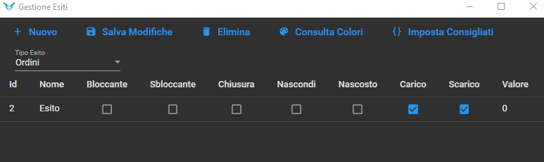

# A COSA SERVE

Il modulo PVIR permette di creare dei viaggi ed avere un riscontro grafico dell'impegno dei mezzi propri e/o vettori.

# FORMAZIONE

La visualizzazione ricorda un calendario e mi permette di vedere com'è distrubuito il lavoro fra i mezzi in uno specifico lasso di tempo che posso decidere.

# FILTRI

Posso filtrare per data, decidere se vedere mezzi, autisti, rimorchi e filtrare per categoria.

dopo ogni azione devo premere il bottoncino aggiorna.

La casella elemento mi permette di filtrare gli elementi da visualizzare.       
*EX: se scrivo A vedrò solamente i mezzi la cui targa comprende la lettera A*

Il filtro per parola chiave invece viene applicato sul contenuto dei rettangoli che rappresentano i viaggi.

- Solo Impegnati: mostra solamente i mezzi che hanno viaggi per la giornata odierna
- Vettori: mostra in visualizzazione solamente i mezzi dei vettori

# CONFIGURAZIONI

Qui dentro ci sono numerose impostazioni che servono a personalizzare l'operatività con il pianificatore.       

> Mostra bottoni e spiega che dalle impostazioni è possibile selezionare una visualizzazione di default e decidere quanti giorni vedere e la dimensione dei rettangoli.

## RETTANGOLI

In questa schermata posso scegliere il colore dei rettangoli che rappresentano i viaggi ed il colore del testo visualizzato all'interno.        

> Eventualmente ci sono altre impostazioni.

## PUNTI

Qui mi posso creare i vari punti per cui passano le conferme come per esempio un magazzino, un porto, una stazione ferroviaria, un aeroporto oppure un semplice punto di scambio per la merce.

Per creare un nuovo punto basta cliccare su nuovo e compilare i vari campi richiesti.       
| Tipo      | Nome Elemento  |HasTreno|HasNave|HasAereo|
|-----------|----------------|--------|-------|--------|
| Magazzino | Magazzino ...  |<ul><li>- [ ] </li></ul>|<ul><li>- [ ] </li></ul>|<ul><li>- [ ] </li></ul>|
| Treno     | Stazione ...   |<ul><li>- [x] </li></ul>|<ul><li>- [ ] </li></ul>|<ul><li>- [ ] </li></ul>|
| Porto     | Porto ...      |<ul><li>- [ ] </li></ul>|<ul><li>- [x] </li></ul>|<ul><li>- [ ] </li></ul>|
| Aereo     | Areroporto ...  |<ul><li>- [ ] </li></ul>|<ul><li>- [ ] </li></ul>|<ul><li>- [x] </li></ul>|

Il campo `Nome Elemento` Posso valorizzarlo come voglio.      
*esempio: stazione di Padova, aeroporto di Venezia, magazzino di Treviso...*

> Se valorizzo il campo ordine in abbinamento vedrò i punti ordinati.

## ESITI

Qui dentro posso configurare gli esiti `Viaggio` e gli esiti `Ordine`.      
Gli esiti **Ordine** sono legati alla Conferma mentre gli esiti **Viaggio** si legano al Viaggio.       

### ORDINI

Questi esiti si vedono nella schermata `Abbinamento Ordini` (la riga associata alla tratta si colora del colore dell'esito) e si vedono anche sulle conferme (esito e data ed ora esito).       

Per configurare un nuovo esito bisogna premere su nuovo e compilare la nuova riga che si crea.



- Nome: Il nome dell'esito
- Chiusura: se l'esito mi chiude il punto
- Carico: Se l'esito è associato al punto di carico
- Scarico: Se l'esito è associato al punto di scarico
- Colore: colore associato all'esito

> Per vedere i colori basta premere sul bottone `Consulta Colori`

Per fare in modo che le conferme "chiuse" scompaiano dalla visualizzazione `Destinazione` in Abbinamento Ordini serve entrare in Punti ed alla voce "Formula Nuova" del punto `Destinazione` va scritto:      
```
AND ISNULL(Esito, '') <> 'nome_esito'
```

> È molto importante configurare ALMENO un'ordine di chiusura altrimenti gli ordini arrivati a destinazione anche dopo l'esito rimarranno visibili.

### VIAGGI

Questi esiti sono configurabili come gli esiti Ordine con l'unica differenza che gli Esiti Viaggio colorano il rettangolo del pianificatore.      


# AGGIUNGI UNA CONFERMA

</img>

Per aggiungere una conferma bisogna premere sul bottone "Aggiungi" nella barra degli strumenti in alto.

# CREAZIONE VIAGGI

</img>

Per creare i viaggi devo premere su Abbinamento e dalla schermata che si apre scelgo il punto di partenza (solitamente Ordini).     
Poi compilo i campi `Targa`, `Rimorchio`, `Autista` e dati vari, seleziono il punto di arrivo e le conferme che conterrà il viaggio ed infine premo abbina.       

# PIANIFICA ARRIVO A DESTINAZIONE

Per far arrivare un viaggio a destinazione devo selezionare come punto di arrivo `DESTINAZIONE` ed esitare gli ordini con un esito di chiusura.     

Per configurare l'esito di chiusura devi andare in `Gestione Punti` e nella colonna `Formula Nuova` devi inserire 

```
AND ISNULL(Esito, '') <> ''
```

> Negli apici dopo <> va inserito il NOME dell'esito di chiusura (esempio "Arrivato")

Una volta configurato l'esito di chiusura ed il punto di arrivo per chiudere un ordine devo entrare in "Abbina Viaggi" ed una volta aperta la griglia degli ordini presenti nel punto "DESTINAZIONE" se premo con il tasto destro su un ordine ho la possibilità di esitarlo.       
Una volta esitato l'ordine in destinazione con un esito di chiusura, l'ordine sparirà dalla griglia.

# TROVA ORDINE

All'interno di questa schermata posso ricercare un ordine e/o le sue tratte.


